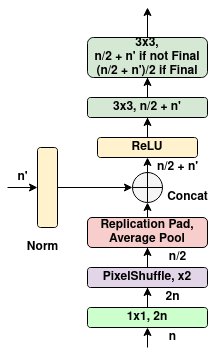
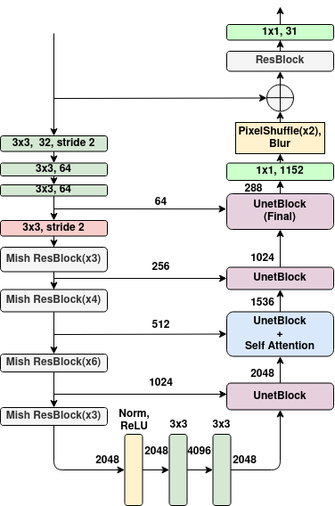
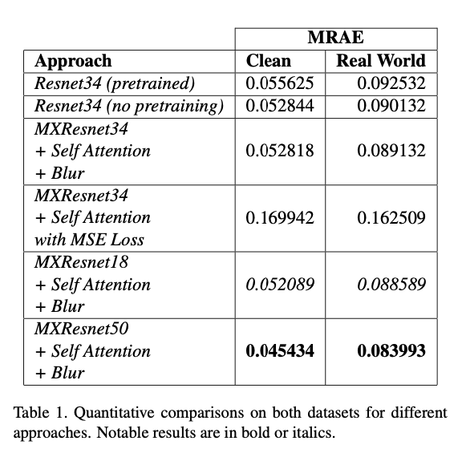
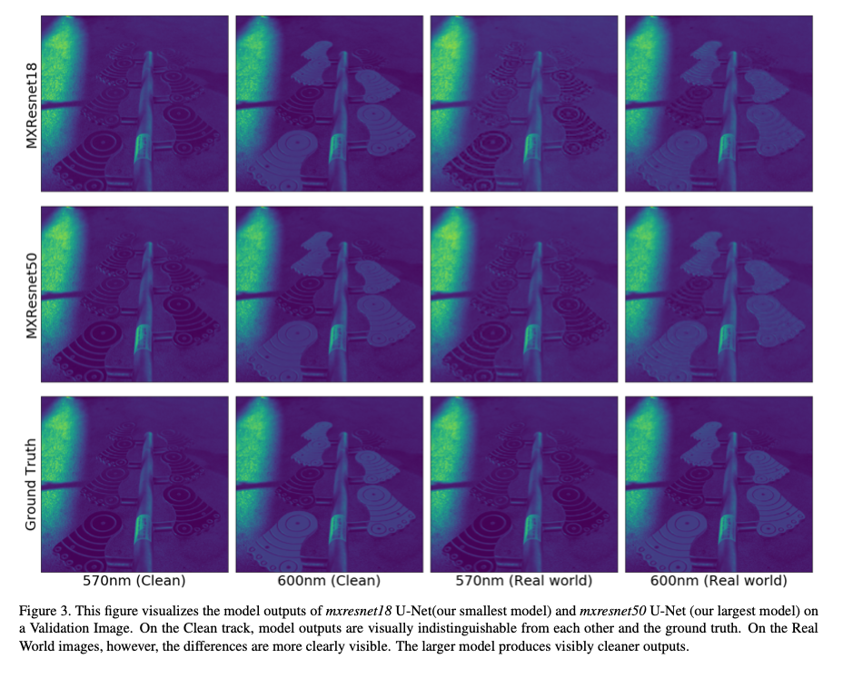
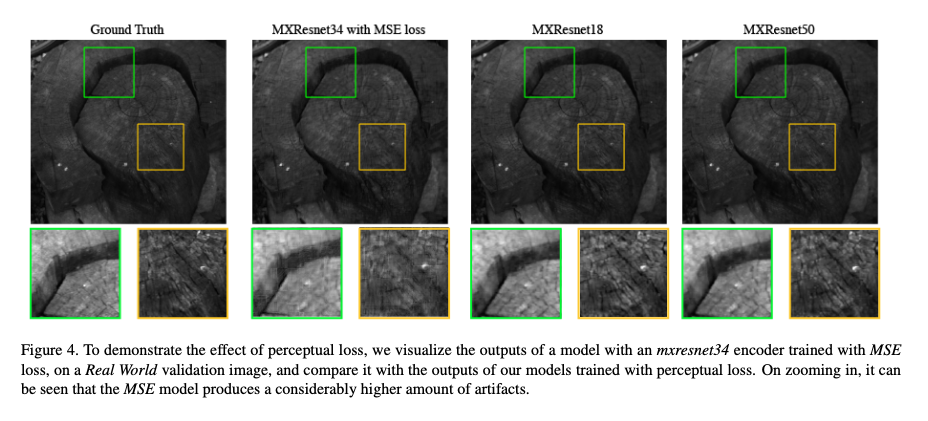

# MXR-U-Nets for Real Time Hyperspectral Reconstruction

## Abstract

In recent times, CNNs have made significant contribu- tions to applications in image generation, super-resolution and style transfer. In this paper, we build upon the work of Howard and Gugger [11], He et al. [10] and Misra, D. [16] and propose a CNN architecture that accurately reconstructs hyperspectral images from their RGB counterparts. We also propose a much shallower version of our best model with a 10% relative memory footprint and 3x faster infer- ence thus enabling real-time video applications while still experiencing only about a 0.5% decrease in performance. 

Our work is significantly inspired by Antic, J.’s work[2] in reconstructing RGB bands from grayscale images. We use a modified version of perceptual loss [12] in our network. This kind of loss function has proved useful in style-transfer [12] and super-resolution [13] applications. It makes networks focus on perceptual details in an image. These details are not easily captured by standard evaluation metrics like RMSE, PSNR or MRAE but are readily visible to humans. We make use of sub-pixel convolutions [23] for upsampling in our decoder. It is an alternative to deconvolution operation for learned upsampling and is extensively used in super-resolution applications. It performs the convolution in a low resolution space and upsamples the result, instead of upsampling first. This approach is much more efficient while being mathematically equivalent to deconvolution.

# Dataset
The dataset was provided in the *New Trends in Image Restoration and Enhancement (NTIRE) Challenge on Spectral Reconstruction* from RGB Images at CVPR 2020 [4]. The datasets for both the competition tracks (Clean and Real World) consist of 450 training images and 10 validation images. The dataset for the clean track of the competition consists of 8-bit uncompressed RGB images and their 31 channel hyperspectral counterparts as ground truth. For the real world track, we have the JPEG compressed 8-bit RGB images as the model input. In our experiments, the training and validation data for the models were as provided in the original datasets.

# Model Architecture
**MXR-Unet-Block:** <br>
<br>
**MXR-Unet:** <br>


# Results / Limited Ablation Studies


# Visualizing Results




# Instructions to run
First, setup the required conda environment with:<br>
```bash
conda env create -f environment.yml
```
<br>

Then, make sure you download the dataset from Codalab and put it in the `../Data` folder relative to the repository. The folders should be named:
1. Train_Clean
2. Validation_Clean
3. Train_RealWorld
4. Validation_RealWorld

Each folder should contain the data as is apparent from the folder name. All the images in the dataest are provided in `.mat` format. You should convert them to `.tiff` files using the `tifffile` python module. We will provide the data pre-processing scripts in a few weeks' time.

You can then run: <br>
```bash
bash experiments.sh
``` 
<br>
This will start running the experiments. 


# References

[1] Andrew P. Aitken, Christian Ledig, Lucas Theis, Jose Ca- ballero, Zehan Wang, and Wenzhe Shi. Checkerboard ar-
tifact free sub-pixel convolution: A note on sub-pixel con- volution, resize convolution and convolution resize. ArXiv, abs/1707.02937, 2017.<br>
[2] Jason Antic. DeOldify, Mar. 2020.<br>
[3] Boaz Arad, Ohad Ben-Shahar, and Radu Timofte. Ntire
2018 challenge on spectral reconstruction from rgb images.
2018 IEEE/CVF Conference on Computer Vision and Pat- tern Recognition Workshops (CVPRW), pages 1042–104209, 2018.<br>
[4] Boaz Arad, Radu Timofte, Ohad Ben-Shahar, Yi-Tun Lin, Graham Finlayson, et al. Ntire 2020 challenge on spectral reconstruction from an rgb image. In The IEEE Conference on Computer Vision and Pattern Recognition (CVPR) Work- shops, June 2020.<br>
[5] YigitBaranCanandRaduTimofte.Anefficientcnnforspec- tral reconstruction from rgb images. ArXiv, abs/1804.04647, 2018.<br>
[6] Ayan Chakrabarti and Todd Zickler. Statistics of real-world hyperspectral images. In CVPR 2011, pages 193–200. IEEE, 2011.<br>
[7] Abhishek Chaurasia and Eugenio Culurciello. Linknet: Ex- ploiting encoder representations for efficient semantic seg- mentation. 2017 IEEE Visual Communications and Image Processing (VCIP), pages 1–4, 2017.<br>
[8] Leon A. Gatys, Alexander S. Ecker, and Matthias Bethge. A neural algorithm of artistic style. ArXiv, abs/1508.06576, 2015.<br>
[9] Kaiming He, Xiangyu Zhang, Shaoqing Ren, and Jian Sun. Deep residual learning for image recognition. 2016 IEEE Conference on Computer Vision and Pattern Recognition (CVPR), pages 770–778, 2016.<br>
[10] Tong He, Zhi Zhang, Hang Zhang, Zhongyue Zhang, Jun- yuan Xie, and Mu Li. Bag of tricks for image classifica- tion with convolutional neural networks. 2019 IEEE/CVF Conference on Computer Vision and Pattern Recognition (CVPR), pages 558–567, 2018.[11] Jeremy Howard and Sylvain Gugger. fastai: A layered api for deep learning. ArXiv, abs/2002.04688, 2020.<br>
[12] Justin Johnson, Alexandre Alahi, and Li Fei-Fei. Perceptual losses for real-time style transfer and super-resolution. In ECCV, 2016.<br>
[13] ChristianLedig,LucasTheis,FerencHusza ́r,Jose ́Anto- nio Caballero, Andrew Aitken, Alykhan Tejani, Johannes Totz, Zehan Wang, and Wenzhe Shi. Photo-realistic single image super-resolution using a generative adversarial net- work. 2017 IEEE Conference on Computer Vision and Pat- tern Recognition (CVPR), pages 105–114, 2016.<br>
[14] Ilya Loshchilov and Frank Hutter. Decoupled weight decay regularization. In ICLR, 2019.<br>
[15] Paulius Micikevicius, Sharan Narang, Jonah Alben, Gre- gory Frederick Diamos, Erich Elsen, David Garc ́ıa, Boris Ginsburg, Michael Houston, Oleksii Kuchaiev, Ganesh Venkatesh, and Hao Wu. Mixed precision training. ArXiv, abs/1710.03740, 2017.<br>
[16] DigantaMisra.Mish:Aselfregularizednon-monotonicneu- ral activation function. ArXiv, abs/1908.08681, 2019.<br>
[17] Vinod Nair and Geoffrey E. Hinton. Rectified linear units improve restricted boltzmann machines. In ICML, 2010.<br>
[18] Rang MH Nguyen, Dilip K Prasad, and Michael S Brown. Training-based spectral reconstruction from a single rgb im- age. In European Conference on Computer Vision, pages 186–201. Springer, 2014.<br>
[19] Manu Parmar, Steven Lansel, and Brian A. Wandell. Spatio- spectral reconstruction of the multispectral datacube using sparse recovery. 2008 15th IEEE International Conference on Image Processing, pages 473–476, 2008.<br>
[20] Antonio Robles-Kelly. Single image spectral reconstruction for multimedia applications. In MM ’15, 2015.<br>
[21] OlafRonneberger,PhilippFischer,andThomasBrox.U-net: Convolutional networks for biomedical image segmentation. ArXiv, abs/1505.04597, 2015.<br>
[22] OlgaRussakovsky,JiaDeng,HaoSu,JonathanKrause,San- jeev Satheesh, Sean Ma, Zhiheng Huang, Andrej Karpathy, Aditya Khosla, Michael Bernstein, Alexander C. Berg, and Li Fei-Fei. ImageNet Large Scale Visual Recognition Chal- lenge. International Journal of Computer Vision (IJCV), 115(3):211–252, 2015.<br>
[23] Wenzhe Shi, Jose Caballero, Ferenc Husza ́r, Johannes Totz, Andrew P. Aitken, Rob Bishop, Daniel Rueckert, and Zehan Wang. Real-time single image and video super-resolution us- ing an efficient sub-pixel convolutional neural network. 2016 IEEE Conference on Computer Vision and Pattern Recogni- tion (CVPR), pages 1874–1883, 2016.<br>
[24] Zhan Shi, Chang Chen, Zhiwei Xiong, Dong Liu, and Feng Wu. Hscnn+: Advanced cnn-based hyperspectral recovery from rgb images. 2018 IEEE/CVF Conference on Computer Vision and Pattern Recognition Workshops (CVPRW), pages 1052–10528, 2018.<br>
[25] Karen Simonyan and Andrew Zisserman. Very deep convo- lutional networks for large-scale image recognition. CoRR, abs/1409.1556, 2014.<br>
[26] Leslie N. Smith. A disciplined approach to neural network hyper-parameters: Part 1 - learning rate, batch size, momen- tum, and weight decay. ArXiv, abs/1803.09820, 2018.<br>
[27] Yusuke Sugawara, Sayaka Shiota, and Hitoshi Kiya. Super- resolution using convolutional neural networks without any checkerboard artifacts. 2018 25th IEEE International Con- ference on Image Processing (ICIP), pages 66–70, 2018.<br>
[28] Less Wright and Evgeny Shalnov. lessw2020/mish: Mxres- net release, Mar. 2020.<br>
[29] Han Zhang, Ian J. Goodfellow, Dimitris N. Metaxas, and Augustus Odena. Self-attention generative adversarial net- works. ArXiv, abs/1805.08318, 2019.<br>
[30] Lichen Zhou, Chuang Zhang, and Ming Wu. D-linknet: Linknet with pretrained encoder and dilated convolution for high resolution satellite imagery road extraction. 2018 IEEE/CVF Conference on Computer Vision and Pattern Recognition Workshops (CVPRW), pages 192–1924, 2018.<br>
